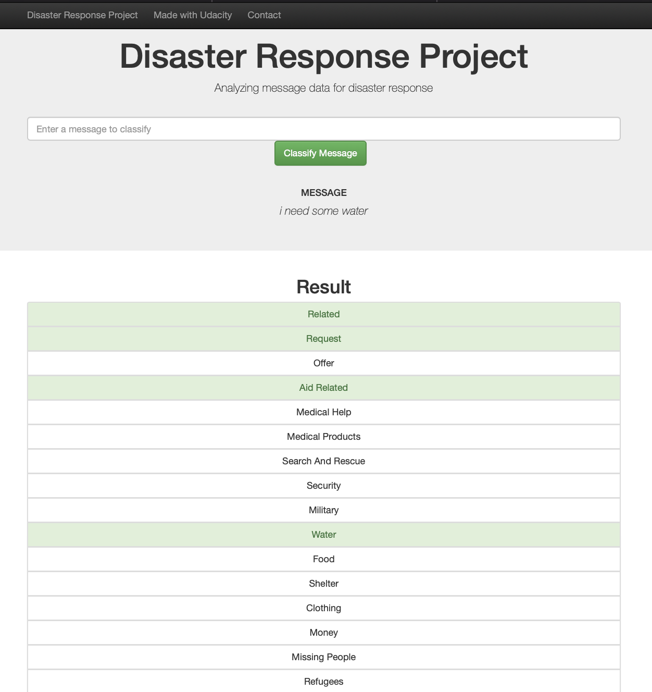

# Disaster Response Pipeline Project

## Intorducation
Disaster Response Web Application is a Web app that can help emergency organizations analyze incoming messages and classify the messages into specific categories (e.g. Water, Food, Hospitals, Aid-Related) during a disaster event. The data was collected by Figure Eight and provided by Udacity.

## Overview
the images below shows the results of the created dashboard.  

  

    

  

  

    

  

## Data

The data files associated with this project are from [here](https://appen.com/datasets-resource-center/)

- messages.csv: FIgure Eight provide 26,248 messages
- categories.csv: Raw categories data, total 36 categories.

## Project Process

### ETL Pipeline

- Loads messages and categories dataset
- Clean data
- Feature Engineering
- Stores it in a SQLite database

### ML Pipeline

- Loads data from the SQLite database
- text processing and machine learning pipeline
- Trains and tunes a model using GridSearchCV
- Exports the model

### Build web app

- Create HTML templates
- Build Flask web application

## Folder Structure

- app  
| - template  
| |- master.html # main page of web app  
| |- go.html # classification result page of web app  
|- run.py # Flask file that runs app  
- data  
|- disaster_categories.csv # data to process  
|- disaster_messages.csv # data to process  
|- process_data.py  
|- InsertDatabaseName.db # database to save clean data to  
- models  
|- train_classifier.py  
|- classifier.pkl # saved model  
- README.md  
